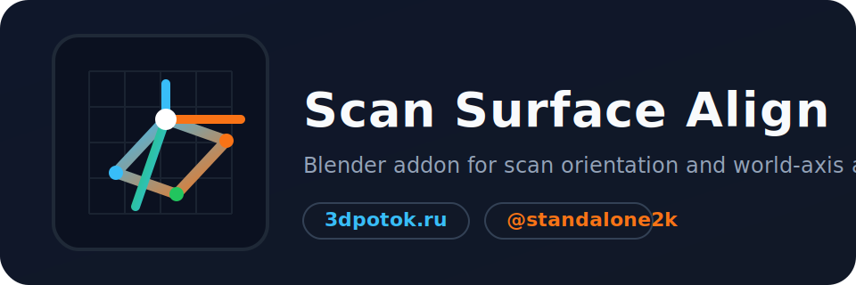
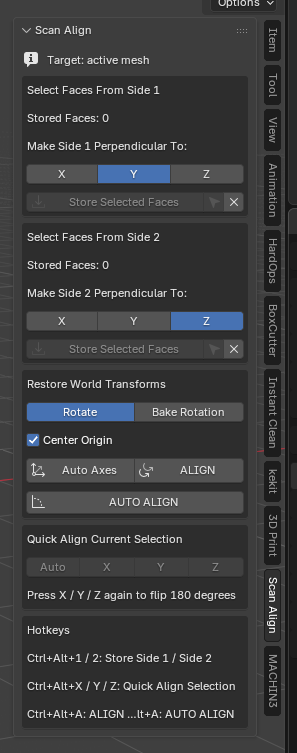

# Scan Surface Align



Blender addon for fast alignment of selected scan surfaces perpendicular to world axes from the right-side `N` panel.

Автор: `Glazyrin Alexey Sergeevich`  
Студия: `3dpotok.ru`  
Telegram: `@standalone2k`  
Website: `https://3dpotok.ru`  
Version: `1.0.3`  
Blender: `5.1`

## RU

`Scan Surface Align` это аддон для Blender, который помогает быстро выравнивать выделенные фрагменты сканов, hard-surface частей и неровных участков меша по мировым осям `X`, `Y`, `Z`.

Аддон сделан для практической работы со сканами: можно сохранить две стороны модели, автоматически подобрать оси, выполнить точное выравнивание в один клик и быстро крутить текущую выборку через `Quick Align`.

### Основной функционал

- Сохранение двух наборов полигонов: `Side 1` и `Side 2`.
- Выравнивание одной стороны перпендикулярно оси `X`, `Y` или `Z`.
- Двухстороннее выравнивание для снятия остаточного поворота.
- `AUTO AXES` для автоматического подбора ближайших мировых осей.
- `AUTO ALIGN` для автоматического выравнивания по сохраненным сторонам.
- `Quick Align` для мгновенного выравнивания текущего выделения.
- Повторное нажатие на `X`, `Y` или `Z` в `Quick Align` переворачивает модель на 180 градусов.
- Режим `Rotate` для обычного поворота объекта.
- Режим `Bake Rotation` для применения поворота к геометрии.
- Опция `Center Origin` для переноса origin в центр после выравнивания.
- Панель справа: `View3D > N-panel > Scan Align`.

### Документация

#### Установка

1. Скачайте архив релиза или создайте `zip` из папки `scan_surface_align`.
2. В Blender откройте `Edit > Preferences > Add-ons > Install...`.
3. Выберите архив и включите `Scan Surface Align`.

#### Быстрый старт

1. Перейдите в `Edit Mode` на mesh-объекте.
2. Выделите полигоны первой стороны и нажмите `Store Selected Faces`.
3. При необходимости выделите вторую сторону и сохраните ее в `Side 2`.
4. Выберите целевые оси вручную или нажмите `Auto Axes`.
5. Нажмите `ALIGN` или `AUTO ALIGN`.

#### Горячие клавиши

- `Ctrl + Alt + 1` -> сохранить `Side 1`
- `Ctrl + Alt + 2` -> сохранить `Side 2`
- `Ctrl + Alt + X / Y / Z` -> `Quick Align`
- `Ctrl + Alt + A` -> `ALIGN`
- `Ctrl + Shift + Alt + A` -> `AUTO ALIGN`

### Медиа-плейсхолдеры

Здесь оставлены пустые места под ваши GIF и скриншоты. Просто загрузите файлы в `docs/media/` и раскомментируйте нужные строки.

```md
<!--  -->
<!--  -->
<!--  -->
<!--  -->
```

Рекомендуемые имена файлов:

- `docs/media/preview-main.png`
- `docs/media/workflow.gif`
- `docs/media/quick-align.gif`
- `docs/media/auto-align.gif`

## EN

`Scan Surface Align` is a Blender addon for quickly aligning selected scan surfaces, hard-surface fragments, and uneven mesh regions perpendicular to the world `X`, `Y`, and `Z` axes.

It is designed for real scan cleanup workflows: you can store two surface sides, auto-pick the closest axes, perform precise final alignment with a single click, and quickly rotate the current face selection using `Quick Align`.

### Key Features

- Store two polygon sets: `Side 1` and `Side 2`.
- Align one side perpendicular to the `X`, `Y`, or `Z` axis.
- Use two-side alignment to remove remaining rotational ambiguity.
- `AUTO AXES` chooses the closest world axes automatically.
- `AUTO ALIGN` aligns the stored sides automatically.
- `Quick Align` instantly aligns the current selection.
- Repeating `Quick Align` on the same `X`, `Y`, or `Z` axis flips the model by 180 degrees.
- `Rotate` mode keeps object rotation.
- `Bake Rotation` applies the rotation directly to mesh geometry.
- `Center Origin` optionally moves the origin after alignment.
- Sidebar location: `View3D > N-panel > Scan Align`.

## Project Structure

```text
scan_surface_align/          Blender addon package
assets/                      Project graphics and logo
docs/media/                  Place your screenshots and GIFs here
README.md                    Project documentation
CHANGELOG.md                 Version history
LICENSE                      Open-source license
```

## Changelog

See [CHANGELOG.md](CHANGELOG.md).

## License

This project is licensed under the GNU General Public License v3.0 or later.

See [LICENSE](LICENSE).

## Contacts

- Studio: `3dpotok.ru`
- Telegram: `@standalone2k`
- Website: `https://3dpotok.ru`
